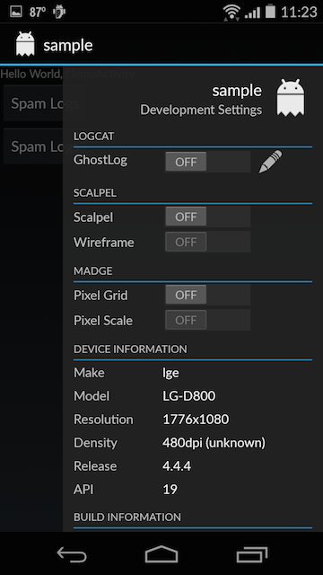

debugdrawer
===========

HEAVILY inspired/built off of JakeWharton's awesome work in [u2020](https://github.com/JakeWharton/u2020).

        DebugDrawer.attach(this, R.layout.main);
or

        DebugDrawer.attach(this, contentView);




	// to add custom debug options        
	DebugGroup testGroup = new DebugGroup("TestGroup",this);
	
	// Text Element
        testGroup.addElement(new TextElement(this,"TextElement","Value"));
        
        // Toggle Button Element
        testGroup.addElement(new ToggleElement("ToggleElement",this) {
            @Override
            public void onAction(Boolean aBoolean) {
                Toast.makeText(DemoActivity.this,"Toggle: " + aBoolean,Toast.LENGTH_SHORT).show();
            }
        });
        
        // Spinner Element
        testGroup.addElement(new SpinnerElement(this,"SpinnerElement",R.array.levels_entries) {
            @Override 
            public void onAction(String s) {
                Toast.makeText(DemoActivity.this,"Spinner: " + s,Toast.LENGTH_SHORT).show();
            }
        });
        
        // Generic Element
        testGroup.addElement(new DebugElement(this,"Custom") {
            @Override public void onAction(Object o) { /* nothing */ }

            @Override
            protected View createView() {
                ImageView imageView = new ImageView(DemoActivity.this);
                imageView.setImageResource(R.drawable.ic_launcher);
                return imageView;
            }
        });

        DebugDrawer.addGroup(testGroup);
        
Download
--------

Download [the latest JAR][1] or grab via Maven:
```xml
<dependency>
  <groupId>com.jug6ernaut</groupId>
  <artifactId>debugdrawer</artifactId>
  <version>0.5.1</version>
</dependency>
```
or Gradle:
```groovy
compile 'com.jug6eranut:debugdrawer:0.5.1'
```


License
-------

    Copyright 2014 William Webb

    Licensed under the Apache License, Version 2.0 (the "License");
    you may not use this file except in compliance with the License.
    You may obtain a copy of the License at

       http://www.apache.org/licenses/LICENSE-2.0

    Unless required by applicable law or agreed to in writing, software
    distributed under the License is distributed on an "AS IS" BASIS,
    WITHOUT WARRANTIES OR CONDITIONS OF ANY KIND, either express or implied.
    See the License for the specific language governing permissions and
    limitations under the License.
    
    
    
[1]: http://repository.sonatype.org/service/local/artifact/maven/redirect?r=central-proxy&g=com.jug6ernaut&a=debugdrawer&v=LATEST
